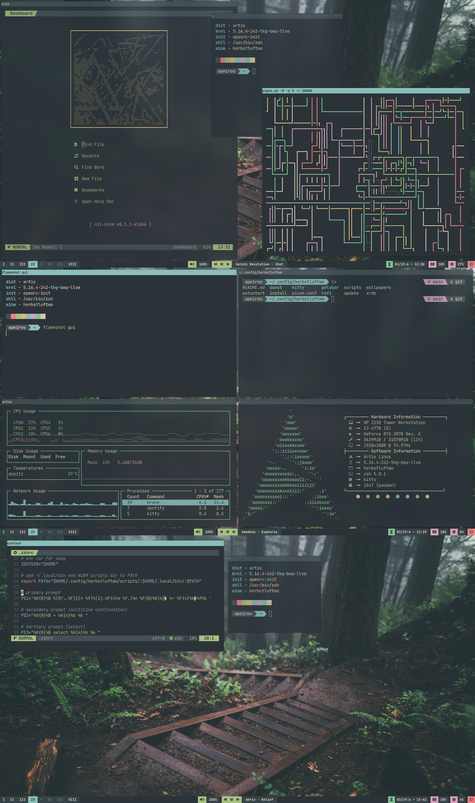

# hlwm-dots
Config files for my herbstluftwm setup (partially finished)

### Required apps/fonts:

##### Install on arch:

`yay -S ttf-unifont ttf-jetbrains-mono nerd-fonts-jetbrains-mono ttf-font-awesome herbstluftwm polybar rofi picom-ibhagwan-git dunst kitty feh playerctl pamixer`

##### Other distros:

Install whichever way is easiest for you, required apps/fonts listed below:

**Apps/programs:**

- herbstluftwm
- polybar
- rofi
- picom (ibhagwan fork)
- dunst
- kitty
- feh
- playerctl
- pamixer
- alacritty *(optional)*
- cool-retro-term *(optional)*
- flameshot *(optional)*
- spotify *(optional, the music scripts are designed for spotify so you might have to modify them if you use something else for music)*

**Fonts:**

- JetBrainsMono
- JetBrainsMono Nerd Font
- Font Awesome 6
- Any font that supports different width Unicode spaces (I use Noto Sans)

### Installation:

If you have all the required apps/fonts, just navigate to `~/.config` and clone this repository, then `cd` into `hlwm-dots` and run the `install` script

Add the following in your shell config: `export PATH="$HOME/.config/herbstluftwm/scripts:$PATH"`

### Screenshot:

### Notes:

The `rofiutil` script is a slightly modified version of `rofi_run` from the ArchLabs distro

GLava configs include the default fragment shaders provided by GLava itself, you may replace the `bars`, `radial`, `graph`, `circle`, `wave`, and `util` folders with symlinks to their respective directories in `/etc/xdg/glava/` and GLava should still work as normal

`zsh` and `nvim` configs (shown in screenshot) are not included in this repo, I might add them later though
