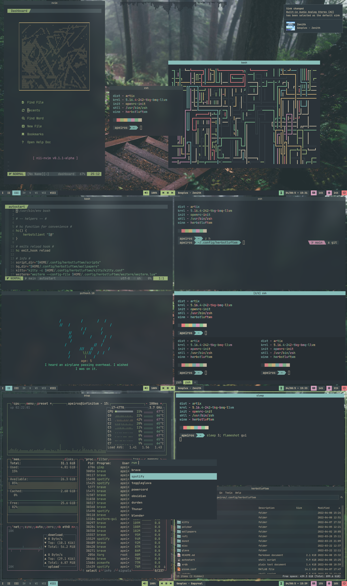

# hlwm-dots
Config files for my herbstluftwm setup (partially finished)

### Required apps/fonts:

##### Install on arch:

`yay -S noto-fonts-main ttf-jetbrains-mono nerd-fonts-jetbrains-mono ttf-font-awesome herbstluftwm polybar rofi picom-ibhagwan-git dunst kitty feh playerctl pamixer`

##### Other distros:

Install whichever way is easiest for you, required apps/fonts listed below:

**Apps/programs:**

- herbstluftwm
- polybar
- rofi
- picom (ibhagwan fork)
- dunst
- wezterm
- feh
- playerctl
- pamixer
- kitty *(optional)*
- flameshot *(optional)*
- spotify *(optional, the music scripts are designed for spotify so you might have to modify them if you use something else for music)*
- pcmanfm *(optional, super+ctrl+f spawns pcmanfm by default)*
- brave *(optional, super+ctrl+b spawns brave by default)*

**Fonts:**

- JetBrainsMono
- JetBrainsMono Nerd Font
- Font Awesome 6
- Any font that supports different width Unicode whitespace characters (I use Noto Sans)

### Installing:

Clone the repo to your config dir: `git clone https://github.com/Apeiros-46B/hlwm-dots ~/.config/hlwm-dots`

`cd` into it: `cd ~/.config/hlwm-dots`

Run the `install` script: `./install`

### Updating:

Run the `update` script in your `herbstluftwm` dir to update your config. This will backup your old config and replace it with a new version from here. If you changed `~/.config/glava` before updating, it will also be backed up

### Screenshot:

### Notes:

The `rofiutil` script is a slightly modified version of `rofi_run` from the ArchLabs distro

GLava configs include the default fragment shaders provided by GLava itself, you may replace the `bars`, `radial`, `graph`, `circle`, `wave`, and `util` folders with symlinks to their respective directories in `/etc/xdg/glava/` and GLava should still work as normal

`zsh` and `nvim` configs (shown in screenshot) are not included in this repo, I might add them later though

You can find my modified version of [HeavyRain266](https://github.com/HeavyRain266)'s startpage [here](https://github.com/Apeiros-46B/startpage)
